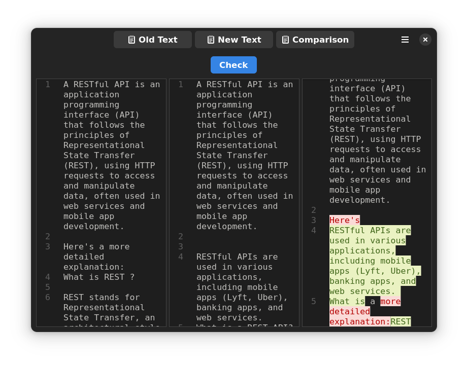
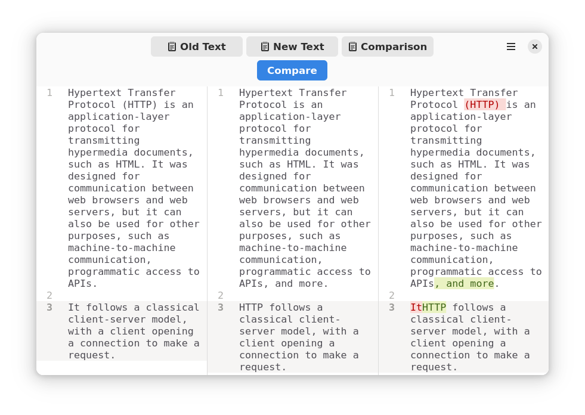

<!-- markdownlint-disable -->

  

<h1 align="center">Text Compare</h1>

<b>Compare old and new text</b>

  

---

## 🖼️ Screenshots

Text Compare supports both **dark** and **light** themes.  
Below you can see the interface in both modes:

### 🌙 Dark Mode

  

### ☀️ Light Mode

  

---

## 📝 About

**Text Compare** is a simple text comparison app for the **GNOME desktop environment**.

---

## ✨ Main Features

- Compare old and new text
- Select comparison token
- Switch between dark, light, or system mode

---

## 🤝 Contributing

If you find this app useful, consider contributing! Here's how you can help:

- ⭐ Star the project on GitHub  
- 🐞 Report bugs (there are probably a few!)  
- 💻 Contribute code  
  - For bug fixes, feel free to open a Pull Request (PR)  
  - For new features, please open an issue first so we can discuss it

---

## 🚀 Run Project Locally

1. Download [GNOME Builder](https://flathub.org/apps/org.gnome.Builder) — the fastest way to get started.  
2. Use GNOME Builder to **clone** this project:  
   > Use the <kbd>Clone Repository</kbd> button at the bottom of the Welcome screen.  
3. Open the project and run it with:  
   - <kbd>Shift</kbd> + <kbd>Ctrl</kbd> + <kbd>Space</kbd>  
   - Or click the <kbd>▶</kbd> button at the top

---

## 📜 License

Text Compare is [free software](https://www.gnu.org/philosophy/free-sw.html) and always will be.  
It is licensed under the terms of the [GNU General Public License v3.0](./LICENSE).

Note: This project is [GPL-3.0 Licensed](./COPYING), and the `jsdiff` library it uses internally is **BSD 3-Clause Licensed**.

---

## 🙏 Acknowledgments

- UI inspired by [Workbench](https://github.com/workbenchdev/Workbench) — thank you Sonny Piers and contributors.  
- Diffing powered by [jsdiff](https://github.com/kpdecker/jsdiff), a JS implementation of [Myers' Difference Algorithm](http://www.xmailserver.org/diff2.pdf) — thanks to Kevin Decker and maintainers.

---

## ©️ Copyright

© 2025 [Joseph Mawa](https://github.com/josephmawa)

<!-- markdownlint-enable -->
